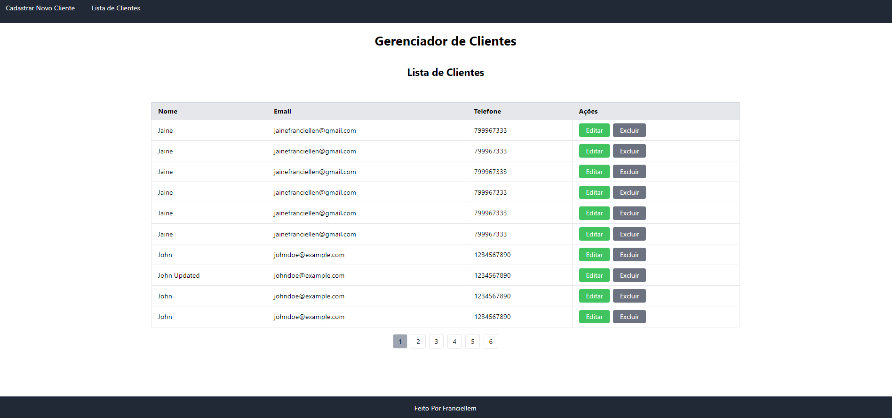

# Customer Management API & Frontend

Este projeto é uma aplicação de gerenciamento de clientes que consiste em uma API desenvolvida em **.NET 8** com **MongoDB** no backend e um frontend construído em **Angular** com **Tailwind CSS**. O projeto também inclui testes de integração para validar o correto funcionamento da API.




## Índice

- [Clonando o Repositório](#clonando-o-repositório)
- [Configurando o Backend (.NET + MongoDB)](#configurando-o-backend-net--mongodb)
- [Configurando o Frontend (Angular + Tailwind)](#configurando-o-frontend-angular--tailwind)
- [Executando os Testes de Integração](#executando-os-testes-de-integração)
- [Sobre a API](#sobre-a-api)
- [Funcionamento dos Testes de Integração](#funcionamento-dos-testes-de-integração)
- [Utilização do Docker](#utilização-do-docker)

---

## Clonando o Repositório

Para clonar este projeto e ter tudo em sua máquina local, execute os seguintes comandos no terminal:

```bash
git clone https://github.com/Jainefranciellem/Customer-api.git
cd Customer-api
```
Certifique-se de ter o .NET 8 SDK, MongoDB e Node.js instalados no seu sistema.

## Configurando o Backend (.NET + MongoDB)
### 1. Instalar Dependências do Backend

Navegue até o diretório da API e instale as dependências do projeto .NET:

```bash
cd Customer-api/CustomerCrudApi
dotnet restore
```
### 2. Configurar o MongoDB

- Certifique-se de ter o MongoDB rodando localmente ou em um serviço remoto.
- Altere o arquivo ``appsettings.json`` para apontar para seu servidor MongoDB. Exemplo de configuração:

```json
{
  "MongoDBSettings": {
    "ConnectionString": "mongodb://localhost:27017/customerDb",
    "DatabaseName": "CustomerDb"
  }
}
```
### 3. Executar a API
Agora que as dependências estão instaladas e o MongoDB está configurado, você pode rodar a API:

```bash
dotnet run
```
A API estará rodando por padrão no endereço: ``https://localhost:5028``.
## Configurando o Frontend (Angular + Tailwind)

### 1. Instalar Dependências do Frontend

No diretório raiz do projeto, vá até o diretório do frontend e instale as dependências do projeto Angular:

````bash
cd CustomerApp
npm install
````
### 2. Executar o Frontend

Após instalar as dependências, execute o comando abaixo para rodar o servidor de desenvolvimento do Angular:

```bash
ng serve
```
O frontend estará acessível em ``http://localhost:4200``.

### 3. Tailwind CSS

Tailwind já está configurado no projeto e será aplicado automaticamente ao rodar o servidor Angular. Não é necessária configuração extra.

## Executando os Testes de Integração
Os testes de integração garantem que os endpoints da API estejam funcionando corretamente.

### 1. Como Funciona o Teste de Integração

Os testes de integração utilizam um ambiente simulado para garantir que as operações CRUD (Create, Read, Update, Delete) de clientes funcionem conforme esperado.

Os testes são executados utilizando o xUnit no projeto .NET, validando se as operações na API estão corretas e se a comunicação com o MongoDB ocorre de maneira apropriada.

### 2. Executando os Testes

Para rodar os testes de integração, você deve navegar até o diretório `backend` e utilizar o comando abaixo:

```bash
dotnet test
```
Isso vai executar todos os testes incluídos no projeto. Caso todos os testes passem, o resultado será exibido no terminal.

## Sobre a API
A API de gerenciamento de clientes permite realizar operações CRUD básicas sobre os clientes da aplicação.

Endpoints
- **GET /api/customer-list:** Retorna todos os clientes.
- **GET /api/customer/{id}:** Retorna um cliente específico pelo seu ID.
- **POST /api/customer-create:** Cria um novo cliente.
- **PUT /api/customer/{id}:** Atualiza um cliente existente.
- **DELETE /api/customer/{id}:** Deleta um cliente específico pelo ID.

### Exemplo de Requisição POST:
```json
{
  "firstName": "Jaine",
  "lastName": "Franciellem",
  "email": "jaineranciellen@gmail.com",
  "phone": "+1234567890"
}
```
## Funcionamento dos Testes de Integração

Os testes de integração simulam requisições HTTP aos endpoints da API e verificam o comportamento esperado em cada uma das operações CRUD. Eles validam, por exemplo:

- Se o cliente é criado corretamente.
- Se as informações de um cliente existente são retornadas corretamente.
- Se um cliente pode ser atualizado.
- Se um cliente pode ser deletado.

Esses testes são importantes para garantir que a API funcione como esperado, mesmo após alterações no código.

```bash
dotnet test --filter "CustomerIntegrationTests"
```


## Utilização do Docker

Esta aplicação utiliza o Docker para facilitar o desenvolvimento e a implantação em ambientes consistentes. Com o Docker, você pode criar contêineres isolados que incluem todas as dependências necessárias, tornando a configuração do ambiente mais simples e rápida.

### Pré-requisitos

Antes de começar, certifique-se de que você tem o [Docker](https://www.docker.com/get-started) instalado na sua máquina.

## Executando a Aplicação

Para executar a aplicação, siga os passos abaixo:

### 1. Clone este repositório:
```bash
git clone https://github.com/Jainefranciellem/Customer-api.git
cd Customer-api
```

### 2. Rode a Docker Compose

```bash
docker-compose up
```

## Contribuições
Contribuições são bem-vindas! Se encontrar algum bug ou quiser adicionar novas funcionalidades, fique à vontade para abrir uma issue ou enviar um pull request.

